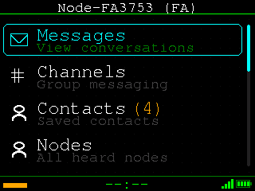
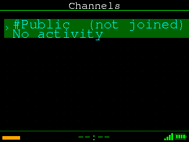

# ezOS

A complete embedded operating system for the **LilyGo T-Deck Plus** (ESP32-S3 with LoRa), featuring encrypted mesh networking, offline maps, and a Lua-scripted user interface.

> ⚠️ **Warning:** This firmware has only been tested on the **T-Deck Plus**. Use at your own risk - no warranty or guarantee is provided.

<p align="center">
  
  
  
</p>

## Download & Flash

**Easiest method** - Use the web flasher (no software install required):

1. Download the latest `ezos-vX.X.X-full.bin` from [Releases](../../releases/latest)
2. Open the [MeshCore Web Flasher](https://flasher.meshcore.co/)
3. Connect your T-Deck Plus via USB and flash

[](../../releases/latest)

## Features

- 📡 **Mesh Networking** - MeshCore protocol with Ed25519 signatures and AES-256-GCM encryption
- 💬 **Channel Chat** - Public and encrypted group channels
- 🔒 **Direct Messages** - Private encrypted messaging
- 🗺️ **Offline Maps** - OpenStreetMap tiles with city/town labels
- 📍 **GPS Integration** - Location sharing with mesh nodes
- 👥 **Contact Management** - Save and organize mesh contacts
- 🎮 **Games** - 2048, Tetris, Pong, Poker, Blackjack, Snake, Solitaire, Sudoku
- 🎨 **Customizable UI** - Themes, wallpapers, icon packs
- 🖥️ **Lua Shell** - Scriptable interface with full API access

## Make It Yours

The entire user interface is written in **Lua** - no C++ or complex build tools required. All hardware is exposed through simple Lua modules, so you can completely reshape the device to fit your needs.

**What you can customize:**
- Create new screens and apps
- Modify the main menu and navigation
- Build custom widgets and overlays
- Add new games or utilities
- Change themes, colors, and layouts
- Automate tasks with background services

**Available Lua modules:**

| Module | Description |
|--------|-------------|
| `ez.display` | Drawing, text, shapes, bitmaps |
| `ez.keyboard` | Key events, trackball input |
| `ez.mesh` | Send/receive messages, node discovery |
| `ez.radio` | LoRa configuration, signal strength |
| `ez.gps` | Location, speed, satellites |
| `ez.storage` | SD card files, preferences |
| `ez.audio` | Tones and melodies |
| `ez.system` | Time, memory, battery, sleep |
| `ez.crypto` | Hashing, encryption, signatures |

**Getting started:**

1. Edit scripts directly on the SD card in `/data/scripts/`
2. Test changes in the [browser simulator](#browser-simulator) - no hardware needed
3. Use [remote control](#remote-control) to execute Lua on the device: `ez_remote.py -e "your code"`

All 40+ screens, 8 games, and every menu you see are plain `.lua` files you can read, modify, and learn from.

## Hardware

**Supported:**
- LilyGo T-Deck Plus (ESP32-S3 + LoRa SX1262)

**Components:**
- 320x240 IPS display
- QWERTY keyboard with trackball
- LoRa radio (868/915 MHz)
- GPS module (optional)
- MicroSD card slot
- USB-C (power, serial, mass storage)

## Building from Source

Pre-built binaries are available in [Releases](../../releases/latest). Building from source is only needed if you want to modify the C++ firmware.

Requires [PlatformIO](https://platformio.org/).

```bash
# Clone
git clone https://github.com/ezmesh/ezos.git
cd ezos

# Build
pio run

# Flash
pio run -t upload
```

## Architecture

```
┌─────────────────────────────────────────────────┐
│                   Lua UI Layer                  │
│  (screens, services, themes, games)             │
├─────────────────────────────────────────────────┤
│               Lua Runtime (5.4)                 │
├─────────────────────────────────────────────────┤
│              C++ Bindings Layer                 │
│  (display, keyboard, mesh, GPS, audio, crypto)  │
├─────────────────────────────────────────────────┤
│                C++ Firmware                     │
│  (hardware drivers, MeshCore, remote control)   │
├─────────────────────────────────────────────────┤
│               ESP-IDF / Arduino                 │
└─────────────────────────────────────────────────┘
```

## Project Structure

```
ezos/
├── src/                    # C++ firmware
│   ├── hardware/          # Display, keyboard, radio, GPS
│   ├── mesh/              # MeshCore protocol
│   ├── lua/bindings/      # Lua API bindings
│   └── remote/            # USB remote control
├── data/scripts/           # Lua UI
│   ├── boot.lua           # Entry point
│   └── ui/
│       ├── screens/       # UI screens (40+)
│       └── services/      # Background services
├── tools/
│   ├── maps/              # Offline map generator
│   ├── simulator/         # Browser simulator
│   └── remote/            # Remote control client
└── docs/                   # Documentation
```

## Tools

### Browser Simulator

Test the UI without hardware using Wasmoon (Lua in WebAssembly):

```bash
cd tools/simulator
npm install
npm start
# Opens http://localhost:3000/tools/simulator/
```

### Offline Maps

Convert OpenStreetMap data to optimized TDMAP format:

```bash
cd tools/maps
pip install -r requirements.txt
python pmtiles_to_tdmap.py netherlands.pmtiles -o netherlands.tdmap
```

Copy the `.tdmap` file to `/sd/maps/world.tdmap` on the SD card.

📖 [Learn more about offline maps](docs/offline-maps.md)

### Remote Control

Control the device over USB serial:

```bash
cd tools/remote
pip install pyserial pillow

# Screenshot
python ez_remote.py /dev/ttyACM0 -s screenshot.png

# Send key
python ez_remote.py /dev/ttyACM0 -k enter

# Execute Lua
python ez_remote.py /dev/ttyACM0 -e "Debug.memory()"
```

📖 [Learn more about remote control](docs/remote-control.md)

## Mesh Networking

ezOS implements the [MeshCore](https://github.com/ripplebiz/MeshCore) protocol:

- **Identity**: Ed25519 keypairs, 6-byte node IDs
- **Routing**: Flood and direct routing modes
- **Encryption**: AES-256-GCM for channels, Ed25519 signatures for all packets
- **Discovery**: ADVERT packets with location, name, role metadata

Compatible with other MeshCore implementations (Ripple Radio, Meshtastic bridges).

## UI System

The interface is entirely Lua-scripted with a stack-based screen manager:

```lua
-- Example screen
local MyScreen = { title = "Hello" }

function MyScreen:new()
    return setmetatable({}, {__index = MyScreen})
end

function MyScreen:render(display)
    display.draw_text_centered(120, "Hello, World!", display.colors.WHITE)
end

function MyScreen:handle_key(key)
    if key.special == "ESCAPE" then return "pop" end
    return "continue"
end

return MyScreen
```

## Configuration

Settings are stored in NVS and restored at boot:
- Display brightness
- Keyboard backlight
- Trackball sensitivity
- Radio TX power
- Node name
- Theme and wallpaper

## License

MIT License - See [LICENSE](LICENSE) for details.

## Acknowledgments

- [MeshCore](https://github.com/ripplebiz/MeshCore) - Mesh networking protocol
- [LilyGo](https://www.lilygo.cc/) - T-Deck hardware
- [Wasmoon](https://github.com/ceifa/wasmoon) - Lua WebAssembly runtime
- [OpenStreetMap](https://www.openstreetmap.org/) - Map data
